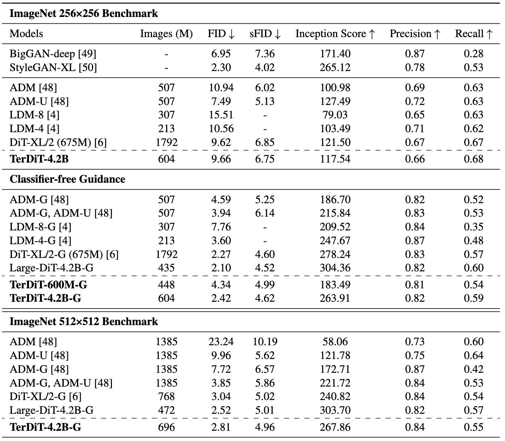

# TerDiT: Ternary Diffusion Models with Transformers

Official Pytorch implementation of TerDiT as presented in paper:

**TerDiT: Ternary Diffusion Models with Transformers**</br>
*Xudong Lu, Aojun Zhou, Ziyi Lin, Qi Liu, Yuhui Xu, Renrui Zhang, Yafei Wen, Shuai Ren, Peng Gao, Junchi Yan, Hongsheng Li*</br>
[paper](https://arxiv.org/abs/2405.14854)


## Installation
Step 1: Please first follow the installation instruction of [Large-DiT-ImageNet](https://github.com/Alpha-VLLM/LLaMA2-Accessory/tree/main/Large-DiT-ImageNet). We use ``cuda-12.1`` and ``gcc 9.4.0``.

Step 2: Install relevant packages
- replace fairscale with our modified package
    ```bash
    cd fairscale
    pip install -e .
    ```
- Install 2-bit kernal function from [hqq](https://github.com/mobiusml/hqq).
    ```bash
    cd kernel
    python3 setup_cuda.py install
    ```

## Checkpoints
We offer trained checkpoints for ImageNet generation at both 256x256 and 512x512 resolutions. For 256x256 resolution, we provide models with 600M and 4.2B parameters. For 512x512 resolution, we offer the 4.2B model. You can find the checkpoints on [huggingface](https://huggingface.co/lucky-lance/TerDiT) 🤗.

## Sample

Run the code for sampling (assume your ckpt is downloaded in ``checkpoints/3B_1180000``):
```bash
python -u sample.py --ckpt checkpoints/3B_1180000 --local_diffusers_model_root  /path/to/diffusers_models --seed 42
```

## Results

TerDiT achieves competitive results with full-precision models. Notably, TerDiT-4.2B outperforms the original DiT on the ImageNet 512x512 task.



## License

This project is released under the MIT license. Please see the [LICENSE](LICENSE) file for more information.

## Questions

Feel free to discuss papers/code with us through issues/emails!

- Xudong Lu: <a href="luxudong@link.cuhk.edu.hk">luxudong@link.cuhk.edu.hk</a> 

## Citation

If you find our paper and code useful in your research, please cite

```
@misc{lu2024terdit,
      title={TerDiT: Ternary Diffusion Models with Transformers}, 
      author={Xudong Lu and Aojun Zhou and Ziyi Lin and Qi Liu and Yuhui Xu and Renrui Zhang and Yafei Wen and Shuai Ren and Peng Gao and Junchi Yan and Hongsheng Li},
      year={2024},
      eprint={2405.14854},
      archivePrefix={arXiv},
      primaryClass={cs.CV}
}
```
